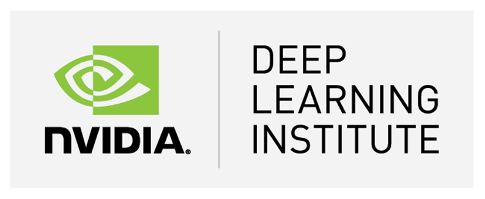

    

[I completed](https://courses.nvidia.com/certificates/20ceae161e844e13a5a3ea35cf15e905)
the course *[Fundamentals of Deep Learning for Computer
Vision](https://courses.nvidia.com/courses/course-v1:DLI+C-FX-01+V2/about)* by the [NVIDIA
Deep Learning Institute](https://www.nvidia.com/en-us/deep-learning-ai/education/). Very
interesting to get some hands-on experience with these exciting new techniques. I'm
looking forward to applying the concepts and learning more!

