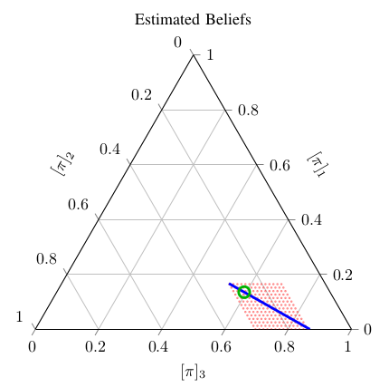

    

I am happy to announce that our paper *Estimating Private Beliefs of Bayesian Agents Based
on Observed Decisions* has been accepted for publication in the [IEEE Control Systems
Letters (L-CSS)](http://ieee-cssletters.dei.unipd.it/index.php). The work has been
developed in collaboration with [Inês Lourenço](https://www.kth.se/profile/ineslo).

In this paper, we investigate how one can estimate how agents perceive the world based on
their decisions and actions. We believe the work has applications, for example, in [social
learning](https://en.wikipedia.org/wiki/Social_learning_theory).
