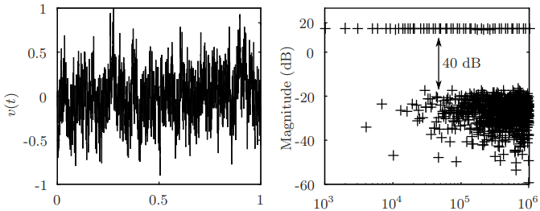

    

Our paper [*A Framework for High-Resolution Frequency Response Measurement and Parameter
Estimation in Microscale Impedance
Applications*](https://www.sciencedirect.com/science/article/pii/S0263224119307705) has
been accepted for publication in the
[Measurement](https://www.sciencedirect.com/journal/measurement) journal. The work has
been developed in collaboration with Roberto Ramírez-Chavarría and [Matias Müller Riquelme](https://www.kth.se/profile/mimr2).

In the paper, we propose a framework for spectral measurement and parameter estimation
applied to [electrical impedance spectroscopy
(EIS)](https://en.wikipedia.org/wiki/Dielectric_spectroscopy) -- an important tool for
characterizing the electrical behavior of matter. The results have potential applications
in biosensor systems (e.g., to measure bacterial concentration and to
detect dangerous pathogens) as well as [human health
monitoring](https://en.wikipedia.org/wiki/Bioelectrical_impedance_analysis).

