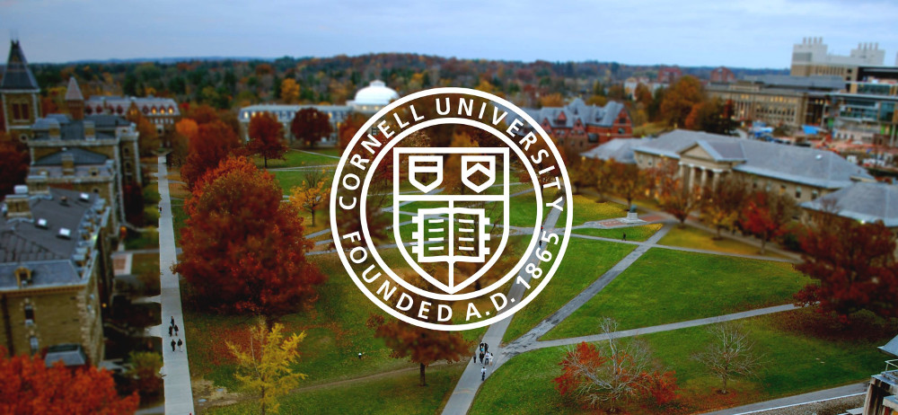

    

I'm currently visiting Prof. [Vikram Krishnamurthy](https://vikram.ece.cornell.edu/) at
[Cornell University](https://www.cornell.edu/) in Ithaca, New York. The purpose of the
visit is to continue our line of research on *inverse filtering* problems that was
initiated with our [NIPS 2017
paper](http://papers.nips.cc/paper/7008-inverse-filtering-for-hidden-markov-models) and
that has continued in the papers [[1](https://ieeexplore.ieee.org/document/8619013),
[2](https://ieeexplore.ieee.org/document/8693524)].

In these problems, the standard filtering problem

> Given observations from a noisy sensor along with a system model, compute estimates of the system's state.

is flipped to

> Given estimates (or actions based on these) of the state, determine how accurate the
> sensors and system model are.

Why are such questions of importance? Inverse filtering problems are partly motivated by
the design of [counter-autonomous
systems](https://papers.ssrn.com/sol3/papers.cfm?abstract_id=2963835): given measurements
of the actions of a sophisticated autonomous adversary, how can our counter-autonomous
system estimate the underlying belief of the adversary, predict future actions and,
therefore, guard against these actions? Answers to these questions have potential
applications in a vast range of fields: (cyber-)security, finance, social networks, to name
a few -- for more, see [this](https://arxiv.org/pdf/1905.07230.pdf) recent paper that
discusses a number of motivational real-world examples and proposes a Bayesian framework
to inverse filtering.

